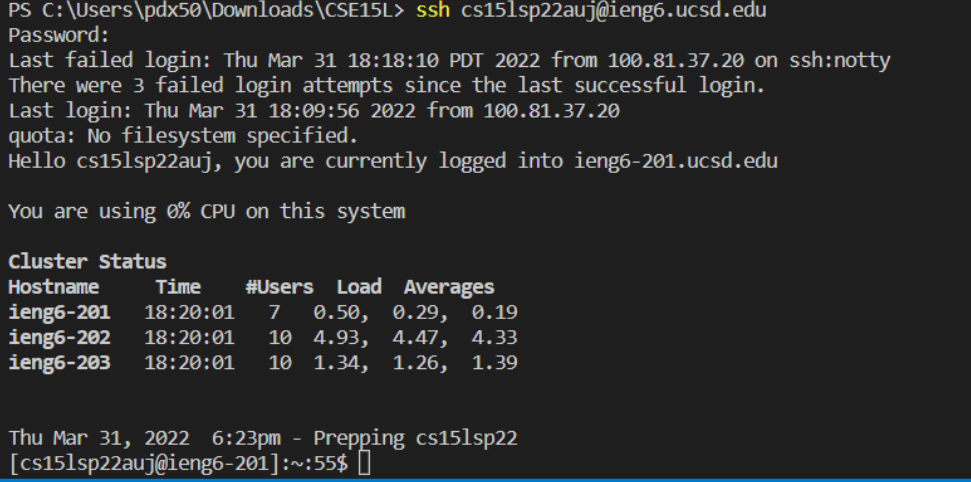

|CSE 15L Lab Report 1 |  |
| ----------- | ----------- |
|This a tutorial on how to log in to your course-specific account on *ieng6*! |

These are the steps I took to get it working:

|Visual Studio Code|  |
| ----------- | ----------- |
|Firstly, you should download Visual Studio Code [here](https://code.visualstudio.com/) if you didn't have it already. |

 You should see a window similar to this when run:

	

| Remotely Connecting|  |
| ----------- | ----------- |
|Then to remotely connect, I typed in the terminal: |

    ssh cs15lsp22auj@ieng6.ucsd.edu
 &nbsp; Your version should be a different email unique to your account. Type in your password and it should look something like this:

&nbsp; (Make sure you downloaded OpenSSH if you're on Windows)

|Trying Some Commands |  |
| ----------- | ----------- |
|There are a lot of commands to try after ssh-ing. |

Here are some commands I tested as shown below:

|Moving Files over SSH with scp |  |
| ----------- | ----------- |
|Next, I remotely sent the file WhereAmI.java with the command:|

    scp WhereAmI.java cs15lsp22auj@ieng6.ucsd.edu:~/
&nbsp; That should successfully send the file as long as your Visual Studio path and email is correct, once you type in the password it will look similar to this:

|Setting an SSH Key |  |
| ----------- | ----------- |
|To set my SSH key, I typed into the terminal: |

    ssh-keygen
&nbsp; (I saved it into /Users/my-username/.ssh/id_rsa and used no passphrase)

&nbsp; Then once the key was made I made a .ssh folder while I was logged into SSH like so:

    mkdir .ssh

Then I logged out, and typed in:

    $ scp /Users/<user-name>/.ssh/id_rsa.pub cs15lsp22zz@ieng6.ucsd.edu:~/.ssh/authorized_keys

That should successfully allow you to log in without entering a password like below:

|Optimizing Remote Running |  |
| ----------- | ----------- |
|Since I no longer needed to enter my password, I noticed I could combine commands to update my code, then compile and run it all into one entry like so. |

&nbsp; I'm still curious on how to further optimize compiling and get it all under 4 seconds though, because my optimization is still not that fast if I manually type it in.