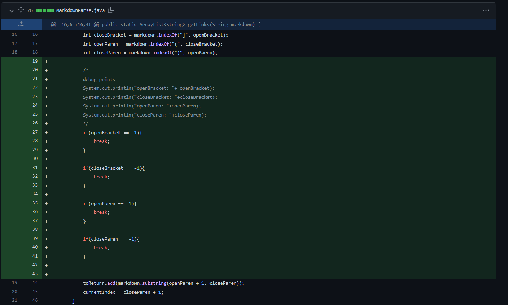
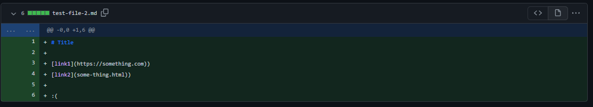
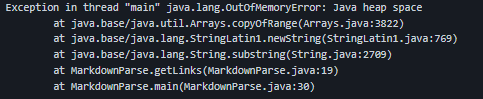
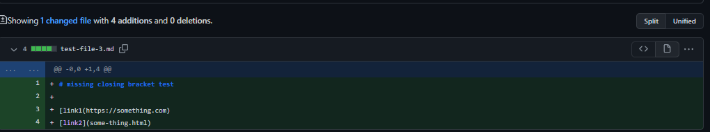
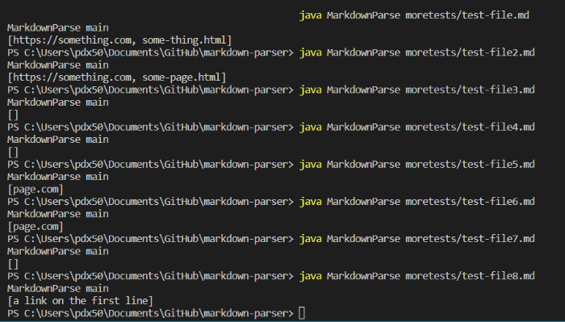
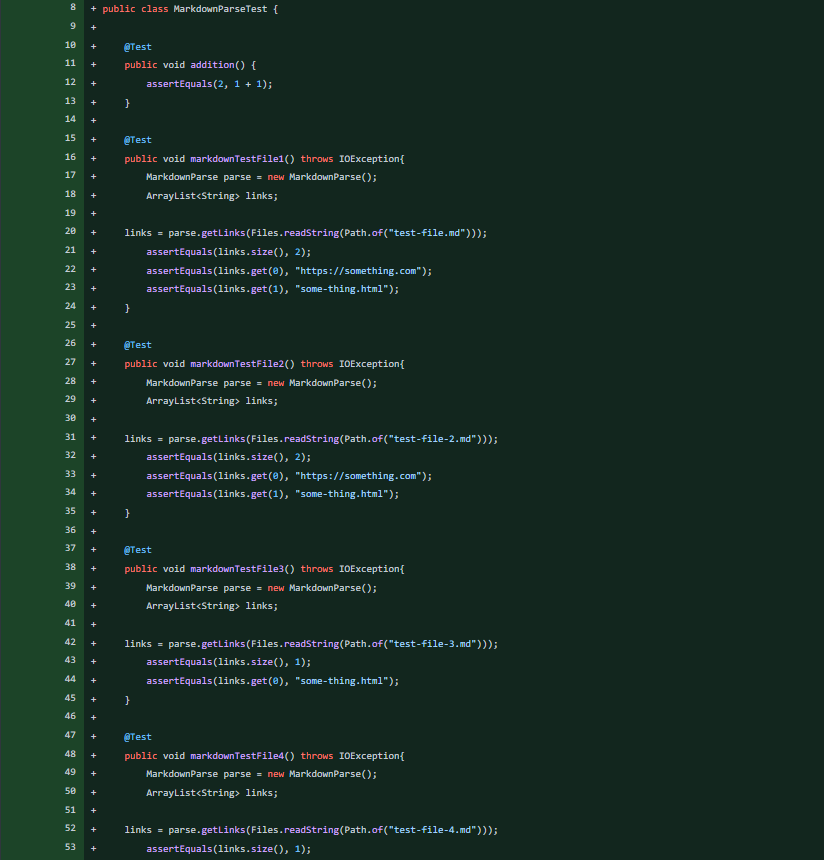
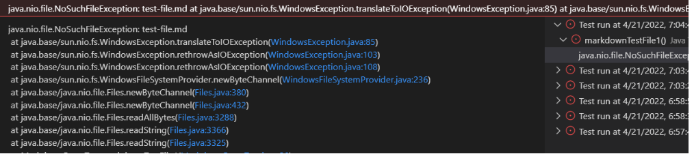

## Intro

In this lab report I will be going over three code changes I made in lab 3 to fix a bug.

## Code Change 1

**Screenshot**

	
Above is a screenshot of the code I added to MarkdownParse.java. 

I added these if statements because my code had a failure-inducing input from a test file.

The test file that caused the failure is [right here.](https://github.com/lexcion/markdown-parser/commit/6c85b60fc69188f72dd4140bdbe0e2318f8d3837), and here is a screenshot of it:

The error message from running the file with the code looked like this:

What caused this bug in the original code was that the original code would break if there were parentheses that weren't in the expected pattern. 

Since the symptom was an out of memory error, the code likely kept on running infinitely because it couldn't proces the unexpected pattern.

To fix the bug, I added the if statements which protected the code from the invalid patterns.

## Code Change 2

Believe it or not, my if statements in the first code change successfully compiled all my test files with their expected results. 

These next 2 code changes will be other changes I made during my lab in order to diagnose some other issue.

The next code change I added to Github was more test case files to try to find more bugs like so:

	

[My code ended up passing this test case,](https://github.com/lexcion/markdown-parser/commit/355f64b4c1be327b4f7c1c34123da2ac41ab338d) and all other test files I made.

It also passed the provided test files during the lab because it outputs the expected output, which we can see in the screenshot below:

So because my first code change fixed all the potential bugs (to my knowledge), there weren't anymore bugs to fix.

Even though I didn't have anymore bugs in the code itself, I still made code changes in terms of diagonistic tools such as these additional test files in order to look for more bugs in my code.

## Code Change 3

This next code change also did not fix any particular bug, but were added as a way to search for more bugs.

I created JUnit tests of each of my test files, which looked like so:

	

The JUnit tests are faster to run and also more accurate for comparing outputs by using the assertEquals method.

These tests did not find any bugs after running them.

And since this code change was made to look for more bugs, then there wasn't any test file that created an unexpected output.

However, there was still a symptom in terms of attempting to run JUnit.

When trying to run JUnit through the Visual Studio testing tab, this error occurred, so the tests couldn't be run at first:

The issue was that visual studio code was not reading the file names properly, shown by the NoSuchFileException.

The solution was:

To run the commands manually (so it uses the libraries) instead of using the run test button in vscode.

## Conclusion

Though technically I only made one code change to fix a bug during this lab, I still made many more code changes in order to further test my program for potential bugs. Such code changes I used to look for bugs was through making additional test files and using JUnit tests to compare the expected and actual outputs of my test files.