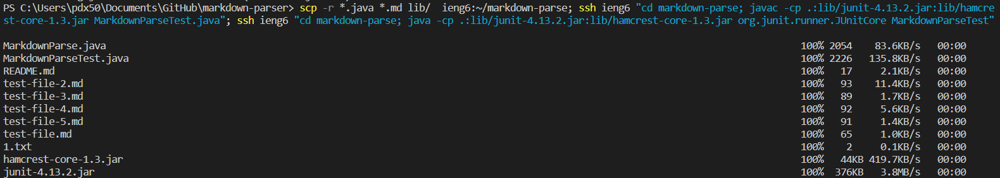
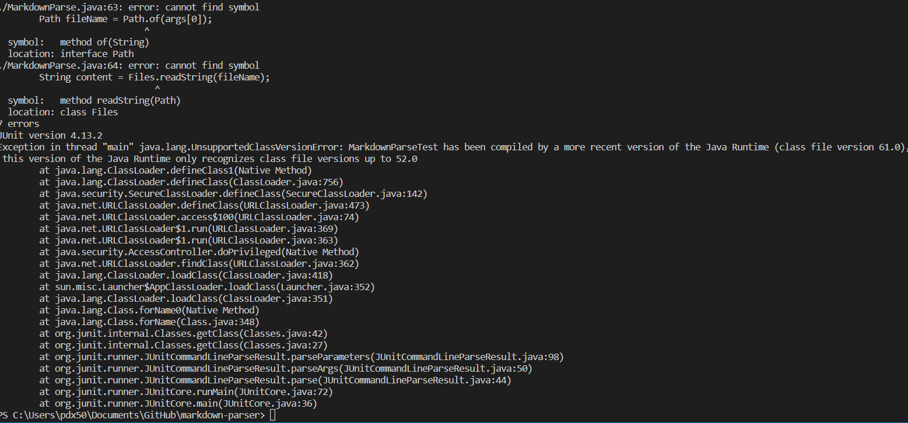

## Lab Report 3 - Justin He

## Streamlining my ssh Configuration

This is my .ssh/config file, which I edited through VSCode:

To log into my ssh account with an alias, I used the command "ssh juh020@ieng6" to log in like so: 

Then I used this scp command to copy the file into my alias.

Now when I log back into my alias and check the files, I can confirm that the testfile was successfully copied in:

## Setting up Github Access from ieng6

Using Github Bash, I can view the public keys stored on Github and my user account (the files with .pub at the end):

And this is the path where my private key is stored in my laptop: 

To commit and push a change on github through my remote account, I first commited my MarkdownParse.java file which outputted this:

Then I pushed the change using "git push origin main":

The link of my commit that I did remotely can be found here:

[Commit link](https://github.com/lexcion/markdown-parser/commit/edd3534254ed18008655c6f9bbab6ab10f23d439)

## Copying whole directories with scp -r

I used a command to copy my markdown-parse directory to the remote account which outputted this:

(And this):

I was then able to log into my remote account, then compile and run the tests remotely:

Lastly, I tried to copy the directory and then compile it all in one line. 

However, I couldn't get the compiling to work because it didn't seem to compile MarkdownParseTest.java correctly. 

Even though when I previously logged in I could compile/run the tests, when I had to log in and compile in a single line it seemed to not use the proper Java packages.

However overall, this lab I learned to more easily log in remotely, commit/push on github through the terminal, and copy/run a directory in the remote server.