## Lab Report 4 - Justin He

In this report I added and tested 3 test cases in my markdown parser code and the lab 7 reviewed code, as well as included commentary on whether I could fix each issue in my code in less than 10 line changes.

## Snippet 1 

According to the VSCode preview here,

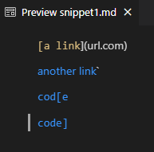

The expected output of snippet 1 should then be this:

    [`google.com, google.com, ucsd.edu]

To test snippet 1, I created a JUnit test that used assertEquals to compare the expected and resulting arraylist like so:

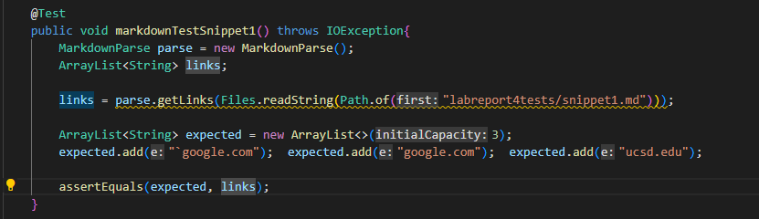

And the outputs of my program and the reviewed implementation for snippet 1 when testing with JUnit were these:

**My program test results:**

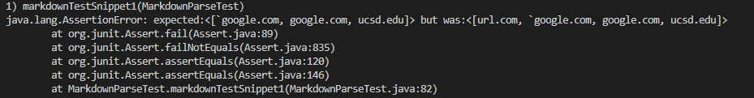

For my markdown parser, the test failed, as it contained an extra link "url.com" in the beginning when it wasn't supposed to.

**Reviewed Implementation Test Results:**

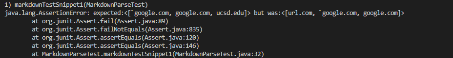

For the reviewed markdown parser, the test also failed, but with a slightly different output.

**Possible Code Change**

The issue in snippet 1 seems to be that my program doesn't detect when a part of a link in markdown is surrounding by backticks, specifically here:

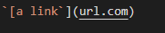

This seems like a fairly simple solution, and the solution would be to implement a check for links between backticks, in which case it would not grab the link.

## Snippet 2

According to the VSCode preview here:

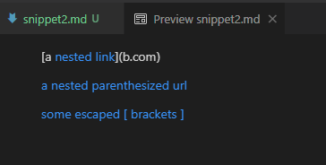

The expected output of snippet 1 should then be this:

    [a.com, , example.com]

To test snippet 1, I created a JUnit test that used assertEquals to compare the expected and resulting arraylist like so:

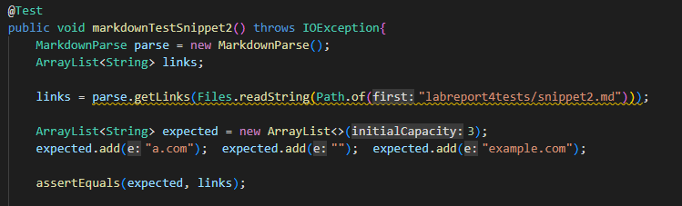

And the outputs of my program and the reviewed implementation for snippet 2 when testing with JUnit were these:

**My program test results:**

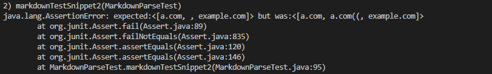

Once again, my program failed to grab the links correctly compared to the expected.

**Reviewed Implementation Test Results:**

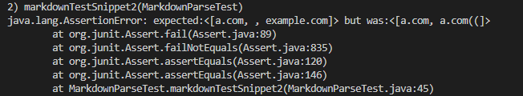

The reviewed implementation also failed to grab the links, and had a slightly different output for snippet 2 than mine.

**Possible Code Change**

My code detected a.com instead of the expected b.com in the first line:

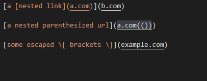

To fix this issue, I don't think it could be fixed in less than 10 lines because in order to check for nested parentheses, I also have to rewrite the parser to read line by line (so that broken parentheses/brackets don't break future links). I also have to consider all the other various parantheses/bracket issues which would take more than 10 lines. 

## Snippet 3

According to the VSCode preview here:

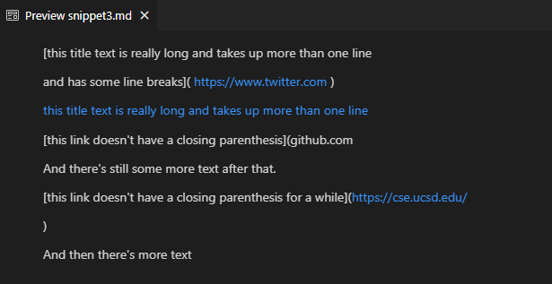

Assuming that the program should grab all blue links, then expected output of snippet 1 should then be this:

    [https://www.twitter.com, https://sites.google.com/eng.ucsd.edu/cse-15l-spring-2022/schedule, https://cse.ucsd.edu/]

To test snippet 1, I created a JUnit test that used assertEquals to compare the expected and resulting arraylist like so:

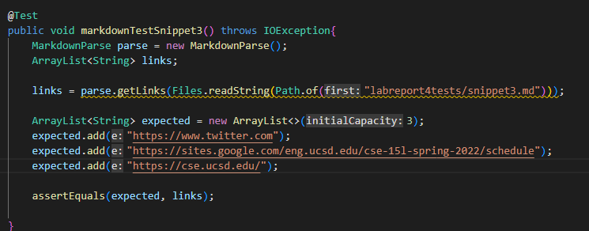

And the outputs of my program and the reviewed implementation for snippet 3 when testing with JUnit were these:

**My program test results:**

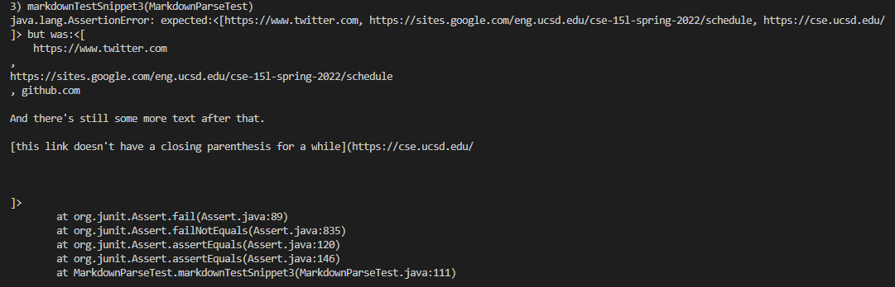

My code also failed for this snippet, which means my code failed the tests for all 3 snippets.

**Reviewed Implementation Test Results:**

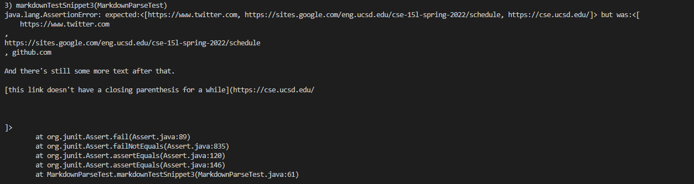

The reviewed implementation also failed all 3 snippets, which means there is a large room for improvement in writing these parsers.

**Possible Code Change**

For snippet 3, once again the main issue is fixing links that take up several lines. To fix this, I would have to allow links that take up consecutive lines like these:

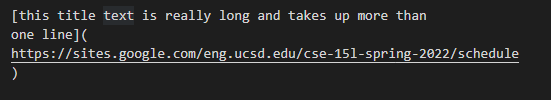

but invalidate links that have entire empty lines between them like this:
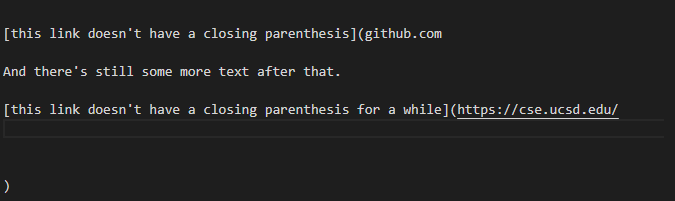

Overall, this fix would probably take more than 10 lines of code because just like snippet 2, I would have to rewrite the parse to read line by line instead of the current IndexOf() implementation which doesn't care about line spacing.