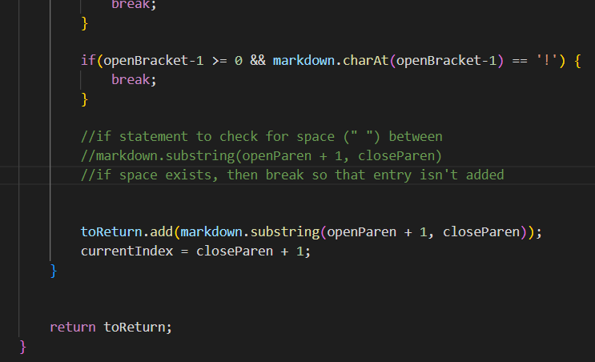

**LAB REPORT 5**

**PART 1: RUNNING A LARGE AMOUNT OF TESTS**

To run all the tests on the provided parser, I logged into ssh and then ran "bash script.sh" to run all the tests on the remote server, which outputed all the tests in this format:

For my own parser, I was able to run all the tests using the code I implemented in lab 9 which looks like this:

I have a print statement for the file name, as well as the returned links, which made it easy to navigate the output as I could see the file names:

Once I printed all the tests, I found two tests that had differing outputs by manually looking for differences in test results for the same markdown file.

**PART 2: TEST ONE**

The first test with differing outputs is test number 567, which you can see the file of at: https://github.com/lexcion/markdown-parser/blob/main/report5tests/567.md

This was an output from the provided parser:

And this was an output from my parser:

As you can see, my parser detected a link called "not a link", while the provided parser detected nothing.

Looking at the preview on VSCode, it seems the expected output for this file is this:

Therefore, neither parser had the correct output as there should have been a link detected that is named "foo" that links to "url1" (neither parser outputted the expected "[url1]").

Looking at why my parser failed, there are two different issues. I will be only focusing on the one bug where my parser grabbed "not a link" when it wasn't supposed to.

After looking at how markdown checks for links and testing it in the preview, it seems that if a link between the brackets contains a space, it will not detect those contents as a link.

Therefore, there should be an additional check after the link is grabbed, to remove it from the list if it contains a space.

In my code I would insert an additional if statement within the getLinks while loop, which eliminates links that contain a space (" ") like so:

**PART 3: TEST TWO**

The second test with a different output is test 577, which there is a link to here:
https://github.com/lexcion/markdown-parser/edit/main/report5tests/577.md

The provided parser outputted this:

While my own implementation outputted this:

The difference is that the provided parser detected a link named "train.jpg" while mine detected no link.

Looking at the expected output on VSCode, the true output is no link because the file is supposed to be an image like so:

Therefore the expected output is "[]" because nothing should be detected, making my own implementation is correct because it ignored the image. The provided parser was wrong because it incorrectly grabbed the image file name.

For the incorrect provided parser, the way to fix the bug is to differentiate between images and links. Specifically, the provided parser does not check for "!" in the beginning of the potential link, which makes it unable to tell the difference between links and images.

I fixed this issue in my own code in an earlier lab by adding an image check in getLinks which looks like this:

I would also insert this if statement into the provided parser within the getLinks while loop but, like so:

Overall, neither my parser or the provided parser was very good at properly getting the links from markdown files.